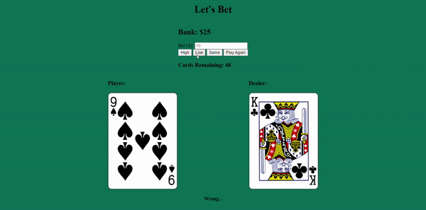

<h1 align="center">High or Low | <a href="https://g-roid.github.io/High-or-Low/">Visit here!</a></h1>

  

<h3 align="center">High or Low</h3>
 
 

## How It's Made:

This project uses the deck of cards API. The player places a bet each turn on the outcome of a hand. The information recieved from the API is filtered and displayed. Local storage is used to preserve the state of the deck and bank balance

<h2 align="center">Techs used:</h2>
 

	
	&nbsp&nbsp&nbsp
	
	&nbsp&nbsp&nbsp
	

##
 

## Optimizations

The project can be optimized by adding media queries to target specific resolutions and media.

## Lessons Learned:

The developer tools allowed me to view the object returned from the API. I was able to log each request and filter out the properties relevant for the project.

